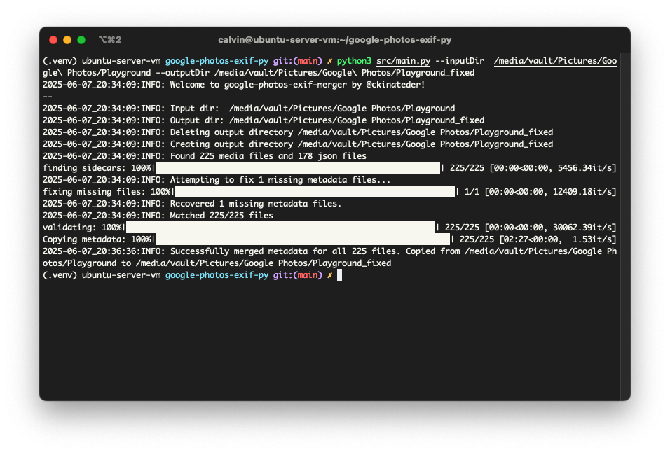

<a id="readme-top"></a>
<!--
*** Thanks for checking out the Google Photos Exif Merger. If you have a suggestion
*** that would make this better, please fork the repo and create a pull request
*** or simply open an issue with the tag "enhancement".
*** Don't forget to give the project a star!
*** Thanks again! Now go create something AMAZING! :D
-->


<!-- PROJECT SHIELDS -->
<!--
*** I'm using markdown "reference style" links for readability.
*** Reference links are enclosed in brackets [ ] instead of parentheses ( ).
*** See the bottom of this document for the declaration of the reference variables
*** for contributors-url, forks-url, etc. This is an optional, concise syntax you may use.
*** https://www.markdownguide.org/basic-syntax/#reference-style-links
-->
[![Contributors][contributors-shield]][contributors-url]
[![Forks][forks-shield]][forks-url]
[![Stargazers][stars-shield]][stars-url]
[![Issues][issues-shield]][issues-url]
[![Unlicense License][license-shield]][license-url]
[![LinkedIn][linkedin-shield]][linkedin-url]


<!-- PROJECT LOGO -->
<br />
<div align="center">
  <a href="https://github.com/ckinateder/google-photos-exif-merger">
    <!--  -->
  </a>

  <h3 align="center">Google Photos Exif Merger</h3>

  <p align="center">
    Merge metadata into media files!
    <br />
    <a href="https://github.com/ckinateder/google-photos-exif-merger"><strong>Explore the docs »</strong></a>
    <br />
    <br />
    <a href="https://github.com/ckinateder/google-photos-exif-merger">View Demo</a>
    &middot;
    <a href="https://github.com/ckinateder/google-photos-exif-merger/issues/new?labels=bug&template=bug-report---.md">Report Bug</a>
    &middot;
    <a href="https://github.com/ckinateder/google-photos-exif-merger/issues/new?labels=enhancement&template=feature-request---.md">Request Feature</a>
  </p>
</div>


<!-- TABLE OF CONTENTS -->
<details>
  <summary>Table of Contents</summary>
  <ol>
    <li>
      <a href="#about-the-project">About The Project</a>
      <ul>
        <li><a href="#built-with">Built With</a></li>
      </ul>
    </li>
    <li>
      <a href="#getting-started">Getting Started</a>
      <ul>
        <li><a href="#prerequisites">Prerequisites</a></li>
        <li><a href="#installation">Installation</a></li>
      </ul>
    </li>
    <li><a href="#usage">Usage</a></li>
    <li><a href="#roadmap">Roadmap</a></li>
    <li><a href="#contributing">Contributing</a></li>
    <li><a href="#license">License</a></li>
    <li><a href="#contact">Contact</a></li>
  </ol>
</details>


<!-- ABOUT THE PROJECT -->
## About The Project



I have wasted so much time trying to merge 400 gigabytes of my exported photos from Google Takeout that I decided to make a tool so that nobody else has to go through this. I tried a bunch of publicly available options, but none worked for me, so I made my own. Hopefully this works for you too. Use at your own risk – although no original files are modified, so no data should be lost.


<p align="right">(<a href="#readme-top">back to top</a>)</p>


### Built With

* [![Python][Python]][Python]
* [ExifTool](https://exiftool.org/)

<p align="right">(<a href="#readme-top">back to top</a>)</p>


<!-- GETTING STARTED -->
## Getting Started

**This tool has only been tested on Linux.**

This is an example of how you may give instructions on setting up your project locally.
To get a local copy up and running follow these simple example steps.

### Prerequisites

Make sure you have Python 3.12 or later installed. 

Install [ExifTool](https://exiftool.org/). Instructions can be found [here](https://exiftool.org/install.html).

(Optional): Docker.

### Installation

1. Clone the repo
   ```sh
   git clone https://github.com/ckinateder/google-photos-exif-merger.git
   ```
2. Install Python packages
   ```sh
   pip install -r requirements.txt
   ```

<p align="right">(<a href="#readme-top">back to top</a>)</p>


<!-- USAGE EXAMPLES -->
## Usage

Use this space to show useful examples of how a project can be used. Additional screenshots, code examples and demos work well in this space. You may also link to more resources.

<!-- _For more examples, please refer to the [Documentation](https://example.com)_-->

Follow the command line argument structure:

```
usage: main.py [-h] --inputDir INPUTDIR --outputDir OUTPUTDIR [--logLevel {DEBUG,INFO,WARNING,ERROR,CRITICAL}]
               [--testCaseDir TESTCASEDIR] [--dryRun]

options:
  -h, --help            show this help message and exit
  --inputDir INPUTDIR   Input directory to read files from
  --outputDir OUTPUTDIR
                        Output directory to COPY files into
  --logLevel {DEBUG,INFO,WARNING,ERROR,CRITICAL}
                        Logging level
  --testCaseDir TESTCASEDIR
                        Path to save the input and output of the sidecar matching into a test case
  --dryRun              Prints what it will do but doesn't execute
```

For example, to process files in `/media/vault/Pictures/Google\ Photos/Photos\ from\ 2020` and copy them into `/media/vault/Pictures/Google\ Photos/Photos\ from\ 2020_fixed`, you'd run

```bash
python3 src/main.py -h --inputDir  /media/vault/Pictures/Google\ Photos/Photos\ from\ 2020 --outputDir /media/vault/Pictures/Google\ Photos/Photos\ from\ 2020_fixed
```

File [`src/__init__.py`](src/__init__.py) contains the list of file extensions that can be processed. By default it is

```python
MEDIA_EXTENSIONS = [".jpg", ".jpeg", ".png", ".heic", ".heif", 
                    ".mp4", ".m4v", ".mov", ".avi", ".mkv", 
                    ".wmv", ".flv", ".f4v", ".f4p", ".f4a", 
                    ".f4b", ".webp", ".gif"]
```
but you can change it if you need to process more/less files. This tool will ONLY process media files if they have an extension listed in `MEDIA_EXTENSIONS`.


### Testing

An important aspect of developing this project is to verify that the output stays the same for a specific directory. One way to do this is in the `test` directory. I have created 5 test cases already. To run them:
```bash
python3 -m unittest -v test.test_main
```

You can also make your own test cases with the `--testCaseDir` flag.
The following command will save the input directory and ouput matchings to `test/scenarios/case0`.
```bash
python3 src/main.py -h --inputDir  /media/vault/Pictures/Google\ Photos/Photos\ from\ 2020 --outputDir /media/vault/Pictures/Google\ Photos/Photos\ from\ 2020_fixed --testCaseDir test/scenarios/case0
```
It is not necessary to make your own test cases.

### Docker

This can also be run in the docker container.
To build with the Dockerfile, run
```bash
docker build -t google-photos-exif-merger .
```
To run it, run
```bash
docker run -v /path/to/input:/app/input -v /path/to/output:/app/output google-photos-exif-merger
```

Example:
```bash
docker run -v /media/vault/Pictures/Google\ Photos/Photos\ from\ 2020:/app/input -v /media/vault/Pictures/Google\ Photos/Photos\ from\ 2020_fixed:/app/output google-photos-exif-merger
```

#### Testing With Docker

It's possible to run tests from Docker too. You'll have to directly enter the container and run it inside:

```bash
$ docker run --rm -it --entrypoint bash google-photos-exif-merger
root@0d7f1829c10a:/app# python3 -m unittest -v test.test_main
```

<p align="right">(<a href="#readme-top">back to top</a>)</p>
<!-- ROADMAP -->

## Roadmap

- [x] Finish file mapping
- [x] Add test cases
- [x] Make file extensions editable
- [x] Add support for metadata with exiftool
- [ ] Add auto fix for wrong file extensions
- [ ] Add support for timezone offset
- [ ] Fix file removal
- [ ] Add final passthrough for JSON validation

See the [open issues](https://github.com/ckinateder/google-photos-exif-merger/issues) for a full list of proposed features (and known issues).

<p align="right">(<a href="#readme-top">back to top</a>)</p>


<!-- CONTRIBUTING -->
## Contributing

Contributions are what make the open source community such an amazing place to learn, inspire, and create. Any contributions you make are **greatly appreciated**.

If you have a suggestion that would make this better, please fork the repo and create a pull request. You can also simply open an issue with the tag "enhancement".
Don't forget to give the project a star! Thanks again!

1. Fork the Project
2. Create your Feature Branch (`git checkout -b feature/AmazingFeature`)
3. Commit your Changes (`git commit -m 'Add some AmazingFeature'`)
4. Push to the Branch (`git push origin feature/AmazingFeature`)
5. Open a Pull Request

### Top contributors:

<a href="https://github.com/ckinateder/google-photos-exif-merger/graphs/contributors">
  
</a>

<p align="right">(<a href="#readme-top">back to top</a>)</p>


<!-- LICENSE -->
## License

Distributed under the Unlicense License. See `LICENSE.txt` for more information.

<p align="right">(<a href="#readme-top">back to top</a>)</p>


<!-- CONTACT -->
## Contact

[Calvin Kinateder](https://calvinkinateder.com)

<p align="right">(<a href="#readme-top">back to top</a>)</p>


<!-- MARKDOWN LINKS & IMAGES -->
<!-- https://www.markdownguide.org/basic-syntax/#reference-style-links -->
[contributors-shield]: https://img.shields.io/github/contributors/ckinateder/google-photos-exif-merger.svg?style=for-the-badge
[contributors-url]: https://github.com/ckinateder/google-photos-exif-merger/graphs/contributors
[forks-shield]: https://img.shields.io/github/forks/ckinateder/google-photos-exif-merger.svg?style=for-the-badge
[forks-url]: https://github.com/ckinateder/google-photos-exif-merger/network/members
[stars-shield]: https://img.shields.io/github/stars/ckinateder/google-photos-exif-merger.svg?style=for-the-badge
[stars-url]: https://github.com/ckinateder/google-photos-exif-merger/stargazers
[issues-shield]: https://img.shields.io/github/issues/ckinateder/google-photos-exif-merger.svg?style=for-the-badge
[issues-url]: https://github.com/ckinateder/google-photos-exif-merger/issues
[license-shield]: https://img.shields.io/github/license/ckinateder/google-photos-exif-merger.svg?style=for-the-badge
[license-url]: https://github.com/ckinateder/google-photos-exif-merger/blob/master/LICENSE.txt
[linkedin-shield]: https://img.shields.io/badge/-LinkedIn-black.svg?style=for-the-badge&logo=linkedin&colorB=555
[linkedin-url]: https://linkedin.com/in/othneildrew
[product-screenshot]: images/screenshot.png
[Next.js]: https://img.shields.io/badge/next.js-000000?style=for-the-badge&logo=nextdotjs&logoColor=white
[Next-url]: https://nextjs.org/
[React.js]: https://img.shields.io/badge/React-20232A?style=for-the-badge&logo=react&logoColor=61DAFB
[React-url]: https://reactjs.org/
[Vue.js]: https://img.shields.io/badge/Vue.js-35495E?style=for-the-badge&logo=vuedotjs&logoColor=4FC08D
[Vue-url]: https://vuejs.org/
[Angular.io]: https://img.shields.io/badge/Angular-DD0031?style=for-the-badge&logo=angular&logoColor=white
[Angular-url]: https://angular.io/
[Svelte.dev]: https://img.shields.io/badge/Svelte-4A4A55?style=for-the-badge&logo=svelte&logoColor=FF3E00
[Svelte-url]: https://svelte.dev/
[Laravel.com]: https://img.shields.io/badge/Laravel-FF2D20?style=for-the-badge&logo=laravel&logoColor=white
[Laravel-url]: https://laravel.com
[Bootstrap.com]: https://img.shields.io/badge/Bootstrap-563D7C?style=for-the-badge&logo=bootstrap&logoColor=white
[Bootstrap-url]: https://getbootstrap.com
[JQuery.com]: https://img.shields.io/badge/jQuery-0769AD?style=for-the-badge&logo=jquery&logoColor=white
[JQuery-url]: https://jquery.com 
[Python]: https://img.shields.io/badge/python-3670A0?style=for-the-badge&logo=python&logoColor=ffdd54
